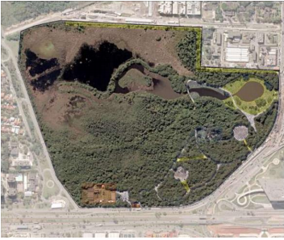

```{r setup, include=FALSE}
knitr::opts_chunk$set(echo = TRUE)
```

## INTRODUÇÃO 
  Espécies invasoras, segundo apresentado por Moro et al. (2012), são
espécies – que ocorrem naquela região biogeográfica graças ao
transporte humano intencional ou não – que conseguem se reproduzir e aumentar seu
tamanho populacional estabelecendo-se no local e também se dispersando de forma
eficiente. 
  Essas espécies podem muitas vezes promover impactos negativos nos ecossistemas eos quais elas chegam, como apontam diversos estudos, tais como: consequências como alterações na estrutura e composição da comunidade, na ciclagem de nutrientes, no acúmulo de serapilheira e de biomassa (HARDMAN et al.,2012; MAROD et al.,2012). Além disso, há estudos que também apontam que essas espécies podem promover a redução da biodiversidade e impactos socioeconômicos negativos (GILBERT & LEVINE, 2012; BELLINGHAM et al., 2018; REASER etal., 2007).
  Embora essas consequências sejam citadas, a elucidação insuficiente da
influência de espécies exóticas invasoras nas comunidades pode acarretar situações
onde grandes esforços de erradicação das mesmas culminam em consequências
diretas ou indiretas ainda maiores para o ecossistema (BERGSTROM et al., 2009).
Consequências tais como a indução de invasões secundárias por outras espécies
exóticas invasoras após iniciativas de manejo (GONZÁLEZ et al.,2017).
  Dessa forma, antes de prejulgar o impacto da espécie e propor iniciativas de
manejo é imprescindível investigar qual o papel daquela espécie no ecossistema em
estudo, para que medidas de conservação eficientes possam ser tomadas e recursos
não sejam desperdiçados (DAVIS et al., 2011). A partir desta perspectiva a seguinte
pergunta é proposta: As espécies exóticas invasoras aqui estudadas estão promovendo
alterações negativas na regeneração natural de espécies nativas em florestas de
restinga? 

## METODOLOGIA 

### ÁREA DE ESTUDO
 
   O estudo foi realizado na unidade de conservação Parque Natural Municipal Bosque da Barra (54 ha), localizado na cidade do Rio de Janeiro. Nesta área há a predominância da formação vegetacional de restingas, que são ambientes geologicamente recentes,sendo formadas por depósitos marinhos quaternários que criaram barreiras ao longo dacosta, aprisionando lagunas e formando cordões arenosos paralelos e depressões entre eles (LAMEGO 1946).
  


  Visando elucidar parte desta pergunta, foram amostrados regenerantes com altura até 30 cm a partir de sub-parcelas de 1x1m sob três diferentes tratamentos. Sendo eles, sob a copa de espécies nativas presentes na área de estudo (10 parcelas), sob a copa da espécie asiática _Talipariti tiliacium_ comumente conhecida como algodoeiro-da-praia (15 parcelas) e sob a copa da espécie _Syzygium cumini_, o jamelão (15 parcelas).  

### Análise de Dados 
  


## RESULTADOS 


! [](Figs/figura01.png)


## REFERÊNCIAS

